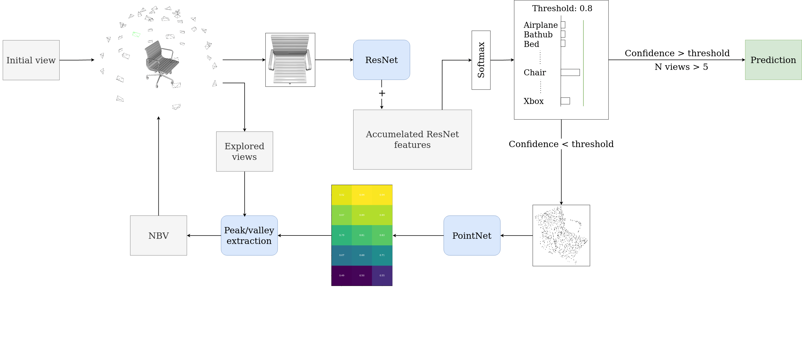

# PointNet Next-Best-View
## Multi-view 3D Object Recognition: Selecting Best Sequences of Views

The pipeline starts with an initial random view chosen from the 40 possible viewpoints. The 2D
RGB image of this view goes into the ResNet classification model, and the value of the output vector
with the highest confidence score is compared to a threshold. If the threshold is reached, we con-
sider the class which belongs to this confidence score as the predicted object class. If it is lower, the
point cloud of the respective view serves as input for the PointNet model. A fully connected neural
network predicts the local entropy map from the PointNet feature. The local entropy map’s highest
peak and lowest valley are extracted and used for the NBV selection. Depending on the object, the
peak or valley is considered the next-best-view. The 2D image of this view serves as input for the
ResNet classification model. The output of the ResNet model is added to the previously predicted
features. The accumulated feature goes into a softmax layer and outputs the confidence scores. This
continues until either the threshold for the confidence score is reached or if a total number of five
viewpoints are explored. Next to the prediction of the local entropy map, we also trained a model
which predicts the local classification performance map.
# Usage
Install dependencies:
```
pip install requirements.txt
```
## Data creation

Create datasets:
```
python data_creation.py [--data <path/to/dataset>] [--set {test,train}]
[--save_depth] [--save_image] [--save_pcd] [--save_part_pcd] 
[--out <path/to/output/directory>] 
[--h_split INT] [--v_split INT]]
```
Example:
```
data_creation.py --data Datasets/ModelNet10 --set train \
--out Datasets/modelnet10_40 --save_image --save_depth --save_pcd --save_part_pcd \
-h_split 5 -v_split 8
```

```
Extract measures:
python extract_measures.py [--data <path/to/dataset>] [--out <path/to/output/directory>]
[--split_set {test,train}] 
[--entropy] [--visible_points] [silhouette_length]
[--resume <path/to/csv/file>] [--verbose]
```

Example:
```
python extract_measures.py --data /media/koen/Data/Datasets/modelnet40_40 \
 --out /media/koen/Data/Datasets/modelnet40_40 --split_set train --entropy
```

## Model training
```
python LEMnet_train.py --data  [--data <path/to/dataset>]
[--model {LCMnet,LEMnet}]
[--batch_size INT]
[--lr FLOAT] [--lr_decay_freq INT] [--lr_decay FLOAT]
[--measure_file_test <path/to/csv_file>]
[--measure_file_train <path/to/csv_file>]
[--epochs INT]

```
Example LCM:

```
python LEMnet_train.py --data  Datasets/modelnet10_40  \
--model LCMnet \
--batch_size 16 \
--lr 0.001 \
--lr_decay_freq 5 \
--lr_decay 0.1 \
--measure_file_test 'baseline_results/Modelnet10_40/best_cls_vp_test.csv' \
--measure_file_train 'baseline_results/Modelnet10_40/best_cls_vp_train.csv' \
--epochs 30
```

Example LEM
```
python LEMnet_train.py --data  Datasets/modelnet10_40  \
--model LEMnet \
--batch_size 16 \
--lr 0.001 \
--lr_decay_freq 5 \
--lr_decay 0.1 \
--measure_file_test 'entropy_measure_test.csv' \
--measure_file_train 'entropy_measure_train.csv' \
--epochs 
```

Example LCM:
```
python LEMnet_train.py --data  Datasets/modelnet10_40  \
--model LCMnet \
--batch_size 16 \
--lr 0.001 \
--lr_decay_freq 5 \
--lr_decay 0.1 \
--measure_file_test 'baseline_results/Modelnet10_40/best_cls_vp_test.csv' \
--measure_file_train 'baseline_results/Modelnet10_40/best_cls_vp_train.csv' \
--epoch 30 
```
## Testing
### Viewpoint classifiction performance
Determine the prediction and confidence score for every single view for every object.
```
python best_cls_vp_extraction.py [--data  <path/to/dataset>]
[--pretrained]
[--batch_size INT]
[--depth {18,34,50,101,152}]
[--model_suffix STRING]
[--view_num {10,40}]
[--resume <path/to/model_file>]
```
Example:
```
python best_cls_vp_extraction.py --data Datasets/modelnet10_40 \
--pretrained \
--batch_size 4 \
--depth {18,34,50,101,152} \
--model_suffix modelnet10_40 \
--view_num 40 \
--resume model_saves/resnet_18_modelnet10_40.pth.tar
```

### Next-best-view testing
```
python best_cls_vp_extraction.py [--data  <path/to/dataset>]
[--nbv_type {map, random, unidirectional, furthest}]
[--map_type {entropy,cls_performance}]
[--cls_model_path <path/to/classification_model}]
[--nbv_model_path <path/to/nbv_model>]
[--num_classes_cls {10,40}]
[--num_classes_NBV_model {10,40}]
--verbose

```
Example:
```
python NBV_testing.py --data Datasets/modelnet10_40 \
--nbv_type map \
--map_type entropy \
--cls_model_path model_saves/resnet_18_modelnet10_40.pth.tar \
--nbv_model_path model_saves/LEPnet10_40_entropy.pth.tar \
--num_classes_cls 10 \
--num_classes_NBV_model 10 \
--verbose
```

```
Example 2:
python NBV_testing.py --data Datasets/modelnet10_40 \
--nbv_type random \
--cls_model_path model_saves/resnet_18_modelnet10_40.pth.tar \
--num_classes_cls 10 \
--verbose
```

# Demo